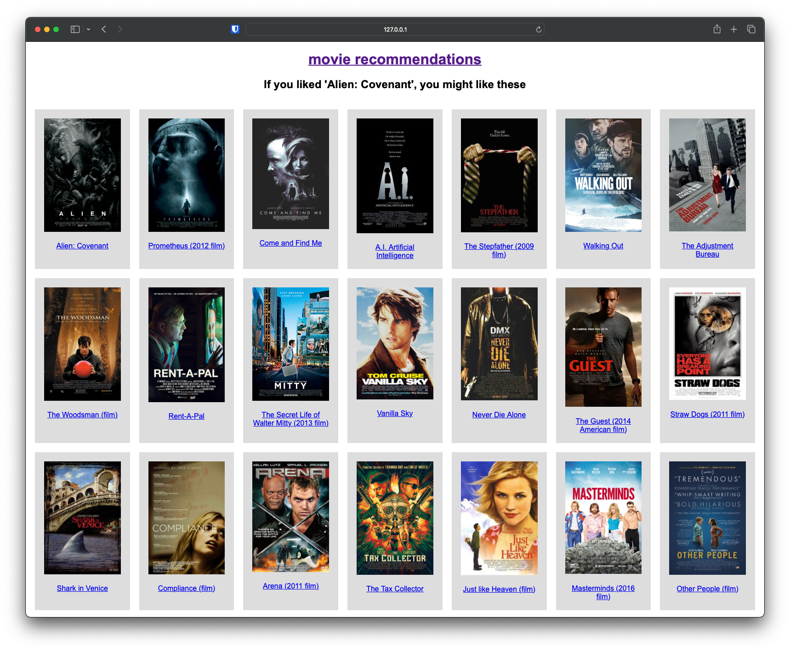

# Movie recommendations web app

This project provides a simple movie recommendation web app using Python and Flask.



## Overview

The recommendation system is built using natural language processing techniques to analyse movie plots and recommend similar movies based on cosine similarity. The project consists of two main files:

- **`build-data.py`**: Script to preprocess movie data, compute similarity scores, and save the processed data for the website.

- **`show-movies.py`**: Flask web app that allows users to explore a random selection of movies or receive recommendations based on a selected movie.

## Installation

```bash
git clone https://github.com/exactful/movie-recommendations-app.git
cd movie-recommendations-app
python3 -m venv venv
source venv/bin/activate
pip3 install -r requirements.txt
```
## Usage

**1. Generate web app data, first time only**

This script processes the movie data, computes the cosine similarity scores and saves the processed data.

Generates two files: the movie data (`movies.csv`) and the similarity data (`similarities.csv`).

```bash
python3 build-data.py
```

**2. Run the web app**

This Flask app allows users to explore a random selection of movies or receive recommendations based on a selected movie.

Go to [http://localhost:5000/](http://localhost:5000/) in your browser after running this command.

```bash
python3 show-movies.py
```

## Dependencies

- Python 3
- Flask
- NumPy
- Pandas
- scikit-learn

## Configuration

File paths can be adjusted in the `config.py` file.